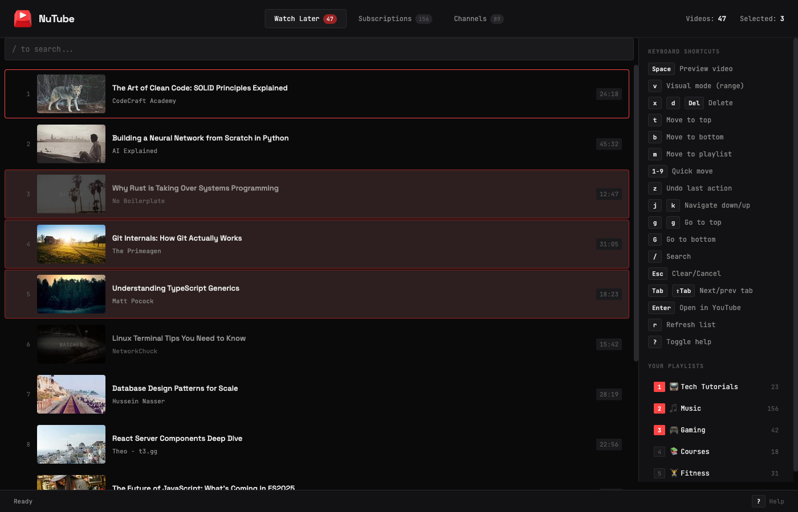

<p align="center">
  
</p>

<h1 align="center">NuTube</h1>

<p align="center">
  <strong>An essential tool to tackle the ever-growing queue</strong><br>
  <sub>Vim-like experience managing Watch Later, Subscriptions, and more!</sub>
</p>

<p align="center">
  <a href="#-quick-start">Quick Start</a> •
  <a href="#-features">Features</a> •
  <a href="#-architecture">Architecture</a> •
  <a href="#-roadmap">Roadmap</a> •
  <a href="#-development">Development</a>
</p>

<p align="center">
  
  
  
  
</p>

<p align="center">
  
</p>

---

## 🚀 Quick Start

```bash
# Clone and install
git clone https://github.com/skulltrail/nutube.git
cd nutube && npm install

# Build
npm run build
```

**Load in Chrome:**

1. Go to `chrome://extensions`
2. Enable **Developer mode**
3. Click **Load unpacked** → select `dist/`

---

## ✨ Features

- 🧹 **Tame Your Watch Later** — YouTube's Watch Later is a graveyard. Removing videos requires hover → menu → click → confirm for _each one_. NuTube lets you select 50 videos and delete them in one keystroke. Or move them all to a playlist instantly.

- 🔍 **Navigate with Intent** — YouTube's Watch Later has no search. No filtering. Just endless scrolling. NuTube gives you instant fuzzy search, jump-to-top/bottom, and keyboard navigation. Find that tutorial from 6 months ago in seconds.

- 📥 **Queue from Subscriptions** — YouTube's subscription feed is view-only. Want to save something? Click the video, wait for load, click menu, click "Save", select playlist, close modal. NuTube lets you queue videos to Watch Later or any playlist without ever leaving the page.

- ✂️ **Audit Your Subscriptions** — Subscribed to 500 channels but only watch 50? YouTube makes unsubscribing a chore. NuTube shows all your channels in one list with activity indicators. See who's gone dormant. Batch-unsubscribe the noise.

- 🧠 **Smart Queue Ranking + Fuzzy Search** — Rank what to watch next by recency/progress/duration fit with `I`, and find items with typo-tolerant fuzzy search across title/channel/tags/notes.

- 🧩 **Companion Everywhere** — Open NuTube from popup, side panel, global keyboard command, or directly inside YouTube via floating launcher and `Alt+Shift+N`.

- 💾 **Portable Backups** — Export/import settings, assignments, watched overrides, hidden videos, and annotations with keyboard shortcuts.

- 🔒 **Privacy-First** — YouTube only, no external services. Zero tracking, no analytics or telemetry. Everything runs locally in your browser. Open source — audit it yourself.

- ⌨️ **Built for Power Users** — Vim keybindings, visual selection mode, undo support, dark terminal aesthetic.

---

## 🔥 Workflows

<details>
<summary><strong>Bulk Cleanup</strong></summary>

```plaintext
v       → Enter visual mode
j/k     → Select range
x       → Delete all selected
```

</details>

<details>
<summary><strong>Quick Categorization</strong></summary>

```plaintext
j/k     → Navigate to video
3       → Move to playlist #3
```

</details>

<details>
<summary><strong>Search & Act</strong></summary>

```plaintext
/       → Type to filter
Ctrl+A  → Select all matches
m       → Move to playlist
```

</details>

---

## ⚙️ Architecture

```plaintext
┌─────────────────────────────────────────────────────────────────┐
│                         NuTube Extension                        │
├─────────────────────────────────────────────────────────────────┤
│                                                                 │
│   ┌──────────────┐    ┌──────────────┐    ┌──────────────────┐ │
│   │  Dashboard   │───▶│  Background  │───▶│  Content Script  │ │
│   │     UI       │    │   Worker     │    │   (YouTube.com)  │ │
│   └──────────────┘    └──────────────┘    └──────────────────┘ │
│         │                    │                     │            │
│         │                    │                     ▼            │
│         │                    │            ┌──────────────────┐ │
│         │                    │            │   InnerTube API  │ │
│         │                    │            │  (Authenticated) │ │
│         │                    │            └──────────────────┘ │
│         │                    │                     │            │
│         ▼                    ▼                     ▼            │
│   ┌─────────────────────────────────────────────────────────┐  │
│   │              Your YouTube Session Cookies               │  │
│   └─────────────────────────────────────────────────────────┘  │
│                                                                 │
└─────────────────────────────────────────────────────────────────┘
```

NuTube speaks directly to YouTube's **InnerTube API** — the same protocol powering youtube.com.

- **No API keys** — Uses your existing session
- **No quotas** — Direct access like the real client
- **Real-time** — Changes sync instantly

---

## 🗺️ Roadmap

### Chrome Web Store

- [ ] Create developer account ($5 fee)
- [ ] Create and host privacy policy
- [ ] Capture screenshots
- [ ] Submit for review

### Features

- [x] Dark/light theme toggle
- [ ] Export Watch Later to text/JSON
- [x] Playlist reordering
- [ ] Video preview on hover
- [ ] Full video playback in dashboard
- [x] Bulk operations progress indicator
- [x] Side panel + popup companion
- [x] Fuzzy search and smart queue ranking

### Improvements

- [x] Better error handling for rate limits
- [x] Retry logic for failed operations
- [x] Keyboard shortcut customization (settings-driven keymap)
- [x] Remember last used tab

---

## 💡 Development

```bash
npm install       # Install dependencies
npm run build     # Production build
npm run dev       # Watch mode
```

<details>
<summary><strong>Project Structure</strong></summary>

```plaintext
src/
├── background.ts    # Service worker message relay
├── content.ts       # YouTube API integration
├── dashboard.html   # Extension UI
└── dashboard.js     # Keyboard handling & state
```

</details>

---

## 👀 Troubleshooting

<details>
<summary><strong>"Not logged into YouTube" error</strong></summary>

- Ensure you're logged into youtube.com
- Refresh YouTube, then refresh the extension dashboard

</details>

<details>
<summary><strong>Videos not loading</strong></summary>

- Press `r` to refresh
- Check console (F12) for errors
- Verify Watch Later has videos

</details>

<details>
<summary><strong>Operations failing</strong></summary>

- YouTube may rate-limit rapid operations
- Slow down between bulk actions
- 409 errors are often false negatives (operation still succeeds)

</details>

---

<p align="center">
  <sub>MIT License • Built with ❤️ for keyboard warriors</sub>
</p>
